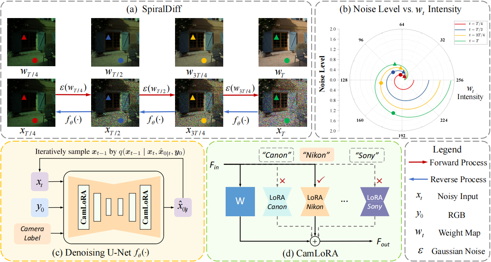

# SpiralDiff: Spiral Diffusion with LoRA for RGB-to-RAW Conversion Across Cameras

<p align="center">
  <a href="https://arxiv.org/abs/2603.14885">
    
  </a>
  
  
</p>

> [**SpiralDiff: Spiral Diffusion with LoRA for RGB-to-RAW Conversion Across Cameras**](https://arxiv.org/abs/2603.14885)  

<p align="center">
  <a href="https://seea.tju.edu.cn/info/1015/1606.htm">Huanjing Yue</a>,
  <a href="https://github.com/Chuancy-TJU/SpiralDiff">Shangbin Xie</a>,
  <a href="https://openreview.net/profile?id=~Cong_Cao1">Cong Cao</a>,
  Qian Wu</a>,
  Lei Zhang</a>,
  Lei Zhao</a>,
  and <a href="https://seea.tju.edu.cn/info/1386/4831.htm">Jingyu Yang</a>
</p>

## ✨ Overview

<p align="center">
  
</p>

RAW images preserve superior fidelity and rich scene information compared with RGB images, making them important for computational photography and downstream vision tasks under challenging imaging conditions.
Recent RGB-to-RAW conversion methods aim to synthesize RAW images from RGB inputs. However, they often overlook two key challenges: **(i)** the reconstruction difficulty varies with pixel intensity, and **(ii)** multi-camera conversion requires camera-specific adaptation. To address these issues, we propose **SpiralDiff**, a diffusion-based framework tailored for RGB-to-RAW conversion. SpiralDiff introduces a signal-dependent noise weighting strategy to adapt reconstruction fidelity across intensity levels. In addition, we propose **CamLoRA**, a camera-aware lightweight adaptation module that enables a unified model to adapt to different camera-specific ISP characteristics. Extensive experiments on four benchmark datasets demonstrate the superiority of SpiralDiff in RGB-to-RAW conversion quality and its downstream benefits in RAW-based object detection.

---

## 🛠️ Requirements

```bash
conda create -n spiraldiff python=3.10
conda activate spiraldiff
pip install -r requirements.txt
```

---

## 📦 Data Preprocessing

### Download Datasets

Download the FiveK dataset from [huggingface](https://huggingface.co/datasets/Chuancy/SpiralDiff) (recommended) or [the official website](https://data.csail.mit.edu/graphics/fivek/) to: `dataset/source_data/FiveK`

Download the NOD dataset from [RAW-NOD](https://github.com/igor-morawski/RAW-NOD) to: `dataset/source_data/NOD`

[Optional] Download the NTIRE 2025 RGB-to-RAW conversion dataset from the [official Hugging Face dataset](https://huggingface.co/datasets/marcosv/rgb2raw) or our processed dataset from [Hugging Face](https://huggingface.co/datasets/Chuancy/SpiralDiff) to: `dataset/data`

If you use the processed dataset, you can skip the preprocessing step.

### Preprocess Dataset

Run the following commands to preprocess the training and testing sets:

```bash
python dataset/process_trainset.py
python dataset/process_testset.py
```

Please edit the `dataset_configs` in `dataset/process_trainset.py` and `dataset/process_testset.py` according to your local dataset paths.

---

## 🚀 Training and Evaluation

Before training or evaluation, please edit the config files in `configs/` to match your dataset path and experimental settings.

### Training

```bash
sh train.sh
```

### Evaluation

Download the pretrained model weights from [our Hugging Face model repository](https://huggingface.co/Chuancy/SpiralDiff), then run:

```bash
sh test.sh
```

---

<!-- ## 📖 Citation

If you find our work useful, please consider citing our paper:

```bibtex
@inproceedings{yue2026spiraldiff,
  title={SpiralDiff: Spiral Diffusion with LoRA for RGB-to-RAW Conversion Across Cameras},
  author={Yue, Huanjing and Xie, Shangbin and Cao, Cong and Wu, Qian and Zhang, Lei and Zhao, Lei and Yang, Jingyu},
  booktitle={IEEE/CVF Conference on Computer Vision and Pattern Recognition},
  year={2026}
}
``` -->

---

## 🙏 Acknowledgements

We are grateful for the following excellent open-source repositories:

- [ResShift](https://github.com/zsyOAOA/ResShift)
- [RAW-Diffusion](https://github.com/SonyResearch/RAW-Diffusion)
- Other related repositories

We sincerely thank the authors for releasing their code.

---

## 📄 License

This project is released under the Apache-2.0 License. See [LICENSE](LICENSE) for details.